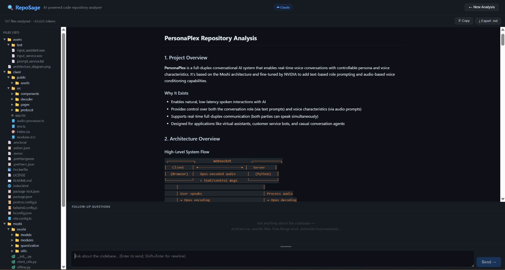
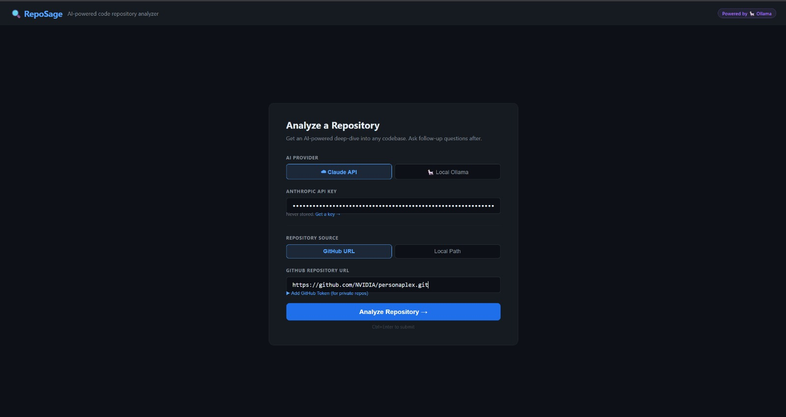

# 🔍 RepoSage

**AI-powered code repository analyzer.** Point it at any GitHub repo or local folder and get a structured, plain-English breakdown of the codebase in seconds — then ask follow-up questions in a chat interface.

[](LICENSE)
[](https://python.org)
[](https://nodejs.org)

---

## The Problem It Solves

Opening a new codebase is overwhelming. You don't know where to start, what the architecture looks like, or which files matter. RepoSage reads the entire repo and gives you a structured, plain-English breakdown in seconds — then lets you ask follow-up questions without leaving the browser.

---

## Screenshots


*Full markdown analysis with collapsible file tree and chat interface*


*Clean input screen — supports Claude API or local Ollama*


*Side-by-side comparison of two repositories with AI-generated diff report*

---

## ✨ Features

- 🧠 **AI-powered deep analysis** — architecture, tech stack, data flow, key files, and onboarding tips
- 💬 **Interactive chat** — follow-up questions with full codebase context
- 🔀 **Compare Mode** `NEW` — analyze two repos side-by-side with an AI-generated differences report
- 📄 **HTML Export** `NEW` — download a fully self-contained `.html` report you can share with anyone
- 🔌 **Custom model endpoint** `NEW` — connect to LM Studio, LocalAI, Jan.ai, or any OpenAI-compatible runner
- 🔒 **Private repo support** — add a GitHub personal access token for private repos
- 🦙 **Local Ollama support** — run 100% offline and free with any installed model
- 📁 **Collapsible file tree** — browse all analyzed files with icons
- ⎘ **Copy & Export** — copy analysis to clipboard or download as `.md`
- 📊 **Token estimate** — see estimated token count before committing
- ⚠️ **Large repo guard** — warns before analyzing repos with 500+ files
- 🔐 **Privacy-first** — API keys and tokens are never stored, never logged
- 🚀 **One-command start** — `./start.sh` launches everything with requirement checks

---

## Quick Start

```bash
git clone https://github.com/yourusername/reposage
cd reposage
chmod +x start.sh
./start.sh
```

Then open **http://localhost:5173** in your browser.

---

## Requirements

| Tool | Minimum Version |
|------|----------------|
| Python | 3.9+ |
| Node.js | 18+ |
| npm | 8+ |
| Git | Any recent version |

> **Optional:** [Ollama](https://ollama.com) for free local AI analysis (no API key needed)

---

## Setup

### Option A — Using Claude API (cloud, best quality)

1. **Clone and enter the repo**
   ```bash
   git clone https://github.com/yourusername/reposage
   cd reposage
   ```

2. **Install backend dependencies**
   ```bash
   cd backend
   pip install -r requirements.txt
   ```

3. **Install frontend dependencies**
   ```bash
   cd ../frontend
   npm install
   ```

4. **Get an Anthropic API key**
   - Go to [console.anthropic.com/settings/keys](https://console.anthropic.com/settings/keys)
   - Create a key and copy it
   - Paste it into the app UI — it's never stored to disk

5. **Run everything**
   ```bash
   cd ..
   ./start.sh         # Linux/macOS/WSL
   ```

   Or manually in two terminals:
   ```bash
   # Terminal 1 — Backend
   cd backend && uvicorn main:app --reload --port 8000

   # Terminal 2 — Frontend
   cd frontend && npm run dev
   ```

---

### Option B — Using Local Ollama (free, offline)

1. **Install Ollama** from [ollama.com](https://ollama.com)

2. **Pull a model** (choose based on your RAM):
   ```bash
   ollama pull llama3.2        # 2 GB — fast, good quality
   ollama pull mistral         # 4 GB — great for code
   ollama pull codellama       # 4 GB — code-specialist
   ollama pull llama3.1:8b    # 5 GB — higher quality
   ```

3. **Start Ollama** (if not already running as a service):
   ```bash
   ollama serve
   ```

4. **Clone RepoSage and start it**
   ```bash
   git clone https://github.com/yourusername/reposage
   cd reposage
   ./start.sh
   ```

5. In the app UI, select **🦙 Local Ollama** — your installed models appear automatically.

---

## New Features

### 🔀 Compare Mode

Compare two repositories side-by-side and let the AI highlight the differences.

**How to use:**
1. Click **⊞ Compare Mode** in the top-right corner of the header
2. Configure each repo independently (GitHub URL or local path, optional token)
3. Select your AI provider once — it applies to both analyses
4. Click **Compare Both →** — both analyses run in parallel with live progress indicators
5. When both are ready, click **Generate Key Differences** for an AI-written comparison report
6. Export the full comparison as a single self-contained HTML file

The comparison report covers: tech stack, architecture, code patterns, complexity, strengths & weaknesses, and a verdict on which codebase is more maintainable.

---

### 📄 HTML Export

Download your analysis as a fully self-contained `.html` file — no internet connection required to view it.

The exported file includes:
- All analysis content rendered as formatted markdown
- Collapsible file tree sidebar
- Metadata header: repo name, date, token count, AI model used
- Dark theme matching the RepoSage interface
- A note that it was generated by RepoSage

Filename format: `reposage-{repo-name}-{YYYY-MM-DD}.html`

Click **⬡ HTML Report** in the analysis toolbar to download.

In Compare Mode, **Export Combined HTML** generates a two-column report with both repos and the differences section.

---

### 🔌 Custom Model Endpoint

Use any OpenAI-compatible inference server — not just Ollama.

When **🦙 Local Ollama** is selected, click **Advanced** to reveal the Base URL field. Change it to point at any compatible runner:

| Runner | Default Port | Example URL |
|--------|-------------|-------------|
| Ollama | 11434 | `http://localhost:11434` |
| LM Studio | 1234 | `http://localhost:1234` |
| LocalAI | 8080 | `http://localhost:8080` |
| Jan.ai | 1337 | `http://localhost:1337` |

The setting is saved to `localStorage` so it persists between sessions.

---

## Project Structure

```
reposage/
├── backend/
│   ├── main.py          # FastAPI app — /analyze, /chat, /compare, /ollama/models
│   ├── analyzer.py      # File walker, GitHub cloner, Claude + Ollama AI calls
│   └── requirements.txt
├── frontend/
│   ├── src/
│   │   ├── App.jsx                      # Root component, screen routing, compare state
│   │   ├── utils/
│   │   │   └── htmlExport.js            # Self-contained HTML report generator
│   │   └── components/
│   │       ├── InputScreen.jsx          # API key, provider toggle, source input
│   │       ├── Analysis.jsx             # Markdown results, toolbar (copy/export)
│   │       ├── ChatBox.jsx              # Streaming follow-up chat
│   │       ├── FileTree.jsx             # Collapsible file explorer
│   │       ├── CompareInputScreen.jsx   # Side-by-side repo configuration form
│   │       └── CompareAnalysis.jsx      # Split-view results + Key Differences panel
│   ├── index.html
│   ├── package.json
│   └── vite.config.js
├── .env.example         # Configurable options (copy to .env to override)
├── .gitignore
├── start.sh             # One-command launcher with requirement checks
└── README.md
```

---

## Configuration

Copy `.env.example` to `.env` to override defaults:

```bash
cp .env.example .env
```

| Option | Default | Description |
|--------|---------|-------------|
| `BACKEND_PORT` | `8000` | FastAPI server port |
| `FRONTEND_PORT` | `5173` | Vite dev server port |
| `OLLAMA_BASE_URL` | `http://localhost:11434` | Default Ollama server URL |
| `MAX_LINES_PER_FILE` | `200` | Lines read per file before truncating |
| `MAX_TOTAL_CHARS` | `400000` | Total character cap (~100k tokens) |
| `LARGE_REPO_THRESHOLD` | `500` | File count that triggers a warning |

> ⚠️ **Never** put API keys or tokens in `.env`. Enter them in the UI — they are held in browser memory only.

---

## FAQ

**Q: Is my API key safe?**
> Yes. It's entered in the UI, held in React state (browser memory only), sent to the local backend over localhost, used for the API call, and then discarded. It's never written to disk, logged, or sent anywhere else.

**Q: Can it analyze private GitHub repos?**
> Yes. Expand "Add GitHub Token" in the input screen and enter a [Personal Access Token](https://github.com/settings/tokens) with `repo` scope. The token is treated the same as the API key — memory only.

**Q: The analysis is cut off / incomplete. Why?**
> Very large repos may exceed the model's context window. RepoSage reads up to 200 lines per file and caps total content at ~400k characters. For huge monorepos, try pointing it at a subdirectory instead.

**Q: Ollama is slow / timing out.**
> Larger models on limited hardware take time. Try a smaller model (`llama3.2` instead of `llama3.1:70b`), or use the Claude API for faster results.

**Q: Can I analyze a subfolder of a repo?**
> Yes — use **Local Path** and enter the path to the subfolder directly.

**Q: Does it work on Windows?**
> The Python backend and React frontend work on Windows. The `start.sh` script requires WSL, Git Bash, or a similar bash environment. Alternatively, run the backend and frontend manually in two terminals (see Setup → Option A, step 5).

**Q: How do I update to the latest version?**
> ```bash
> git pull
> pip install -r backend/requirements.txt
> npm --prefix frontend install
> ```

**Q: Can I use Compare Mode with one GitHub repo and one local repo?**
> Yes — each repo panel has its own source toggle. Mix and match GitHub URLs and local paths freely.

**Q: The HTML export looks different from the app. Is that expected?**
> The exported HTML uses an embedded markdown renderer and self-contained CSS. It closely matches the app's dark theme but is intentionally simplified so it works without any external dependencies — open it in any browser, on any machine, with no internet connection.

---

## Contributing

Contributions are welcome! To get started:

1. Fork the repo and create a branch: `git checkout -b feature/my-feature`
2. Make your changes (backend in `backend/`, frontend in `frontend/src/`)
3. Test locally with `./start.sh`
4. Open a pull request with a clear description of what changed and why

Please keep PRs focused — one feature or fix per PR makes review easier.

---

## License

MIT — see [LICENSE](LICENSE). Use it, fork it, build on it.

---

<sub>Built with [FastAPI](https://fastapi.tiangolo.com), [React](https://react.dev), and [Claude](https://anthropic.com) · [Ollama](https://ollama.com) support for local inference</sub>
